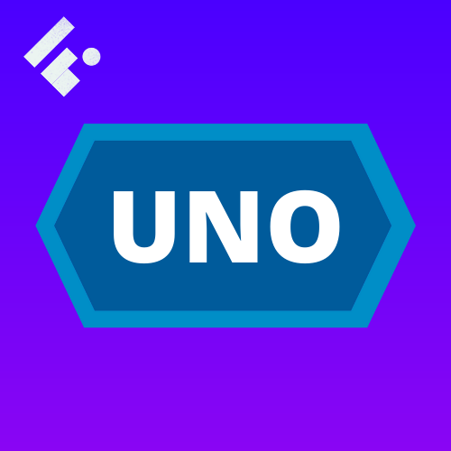
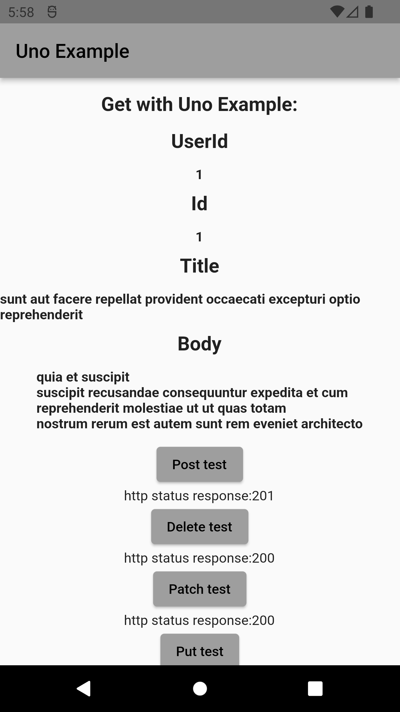
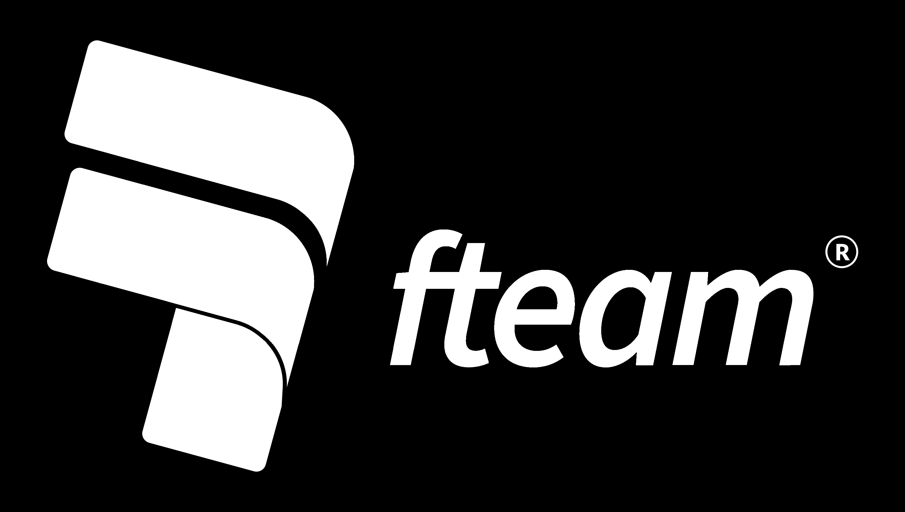
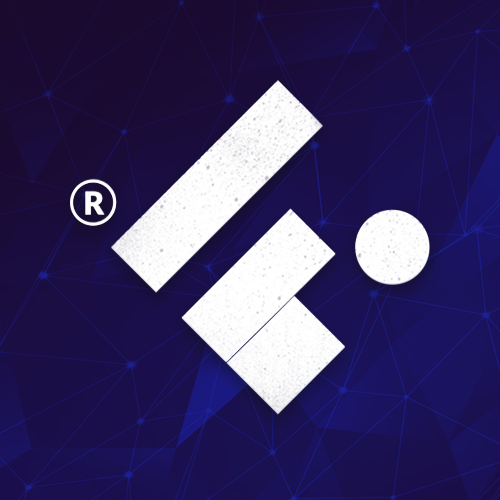

<a name="readme-top"></a>


<h1 align="center">UNO - Future based HTTP client for Dart and Flutter.</h1>

<!-- PROJECT LOGO -->
<br />
<div align="center">
  <a href="https://pub.dev/packages/uno">
    
  </a>

  <p align="center">
    Uno, inspired by Axios, brings a simple and robust experience to crossplatform apps in Flutter and server apps in Dart.
    <br />
    <a href="https://pub.dev/documentation/uno/latest/"><strong>Explore the docs »</strong></a>
    <br />
    <br />
    <!-- <a href="https://github.com/othneildrew/Best-README-Template">View Demo</a> -->
    <!-- · -->
    <a href="https://github.com/Flutterando/uno/issues">Report Bug</a>
    ·
    <a href="https://github.com/Flutterando/uno/issues">Request Feature</a>
  </p>

<br>

<!--  SHIELDS  ---->

[](https://github.com/Flutterando/uno/blob/master/LICENSE)
[](https://pub.dev/packages/uno/score)
[](https://github.com/Flutterando/uno/graphs/contributors)
[](https://github.com/Flutterando/asuka/graphs/contributors)

[](https://pub.dev/publishers/flutterando.com.br/packages)
[](https://www.youtube.com/flutterando)
</div>

<br>

<!-- TABLE OF CONTENTS -->
<details>
  <summary>Table of Contents</summary>
  <ol>
    <li><a href="#about-the-project">About The Project</a></li>
    <li><a href="#sponsors">Sponsors</a></li>
    <li><a href="#how-to-use">How To Use</a></li>
    <li><a href="#features">Features</a></li>
    <li><a href="#contributing">Contributing</a></li>
    <li><a href="#license">License</a></li>
    <li><a href="#contact">Contact</a></li>
    <li><a href="#acknowledgements">Acknowledgements</a></li>
  </ol>
</details>

<br>

<!-- ABOUT THE PROJECT -->
## About The Project

<br>
<Center>

</Center>

<br>

Uno is a multiplatform HTTP client, based on Axios and built following the Clean Dart approach by the Flutterando Community.
It is a simple and hassle free solution while still bringing everything you need and a bit more in a HTTP client. 


<p align="right">(<a href="#readme-top">back to top</a>)</p>

<!-- SPONSORS -->
## Sponsors

<a href="https://fteam.dev">
    
  </a>

<p align="right">(<a href="#readme-top">back to top</a>)</p>
<br>


<!-- GETTING STARTED -->
## Getting Started

To install Uno in your project you can follow the instructions below:


a) Add in your pubspec.yaml:
   ```sh
   dependencies:
   uno: <last-version>
   ```
   
b)    or use:
   ```sh
   dart pub add uno
   ```

<p align="right">(<a href="#readme-top">back to top</a>)</p>

<!-- USAGE EXAMPLES -->
## How To Use

Uno is ready for REST APIs. Methods like GET, POST, PUT, PATCH, DELETE are welcome here!

```Dart
final uno = Uno();

// Make a request for a user with a given ID
uno.get('/users?id=1').then((response){
  print(response.data); // it's a Map<String, dynamic>.
}).catchError((error){
  print(error) // It's a UnoError.
});
```

_For more examples, please refer to the_ [Documentation](https://pub.dev/documentation/uno/latest/)


<p align="right">(<a href="#readme-top">back to top</a>)</p>


<!-- ROADMAP -->
## Features

- ✅ GET
- ✅ POST
- ✅ PATCH
- ✅ PUT
- ✅ DELETE
- ✅ Interceptors
- ✅ Error Handler
- ✅ Multipart/FormData

Right now this package has concluded all his intended features. If you have any suggestions or find something to report, see below how to contribute to it.

<p align="right">(<a href="#readme-top">back to top</a>)</p>


<!-- CONTRIBUTING -->
## Contributing

🚧 [Contributing Guidelines](https://github.com/angular/angular/blob/main/CONTRIBUTING.md) - Currently being updated 🚧

Contributions are what make the open source community such an amazing place to learn, inspire, and create. Any contributions you make are **greatly appreciated**.

If you have a suggestion that would make this better, please fork the repo and create a pull request. You can also simply open an issue with the appropriate tag. 
Don't forget to give the project a star! Thanks again!

1. Fork the Project
2. Create your Feature Branch (`git checkout -b feature/AmazingFeature`)
3. Commit your Changes (`git commit -m 'Add some AmazingFeature'`)
4. Push to the Branch (`git push origin feature/AmazingFeature`)
5. Open a Pull Request

Remember to include a tag, and to follow [Conventional Commits](https://www.conventionalcommits.org/en/v1.0.0/) and [Semantic Versioning](https://semver.org/) when uploading your commit and/or creating the issue. 

<p align="right">(<a href="#readme-top">back to top</a>)</p>


<!-- LICENSE -->
## License

Distributed under the MIT License. See `LICENSE.txt` for more information.

<p align="right">(<a href="#readme-top">back to top</a>)</p>


<!-- CONTACT -->
## Contact

Flutterando Community
- [Discord](https://discord.gg/qNBDHNARja)
- [Telegram](https://t.me/flutterando)
- [Website](https://www.flutterando.com.br/)
- [Youtube Channel](https://www.youtube.com.br/flutterando)
- [Other useful links](https://linktr.ee/flutterando)


<p align="right">(<a href="#readme-top">back to top</a>)</p>


<!-- ACKNOWLEDGMENTS -->
## Aknowledgements
Thank you to all the people who contributed to this project, whithout you this project would not be here today.

<a href="https://github.com/flutterando/Uno/graphs/contributors">
  
</a>

<p align="right">(<a href="#readme-top">back to top</a>)</p>

## Maintaned by

---

<br>
<p align="center">
  <a href="https://www.flutterando.com.br">
    
  </a>
  <p align="center">
    Built and maintained by <a href="https://www.flutterando.com.br">Flutterando</a>.
  </p>
</p>